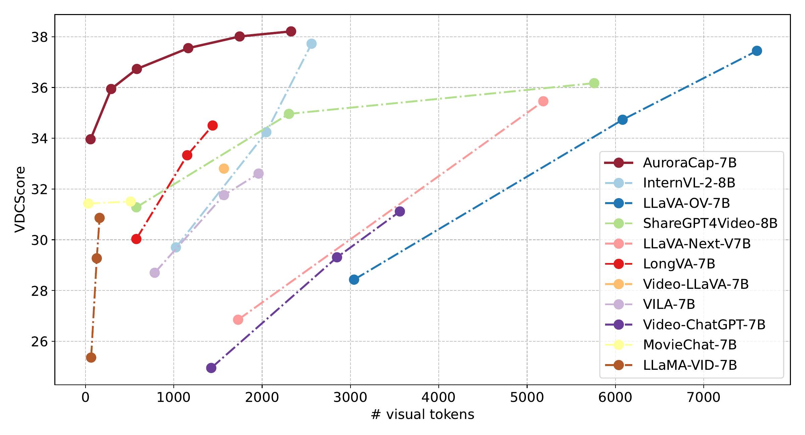

# Aurora Series
A more efficient multimodal large language model series.

<table><tr><td>
    <strong>AuroraCap</strong>: Efficient, Performant Video Detailed Captioning and a New Benchmark, ICLR, 2025.
</td></tr>
</table>

[](docs/auroracap/README.md)
[](https://rese1f.github.io/aurora-web/)
[](https://arxiv.org/abs/2410.03051)
[](https://huggingface.co/collections/wchai/auroracap-66d117ffe13bedda96702013)
[](https://huggingface.co/datasets/wchai/Video-Detailed-Caption)
[](https://huggingface.co/datasets/wchai/AuroraCap-trainset)




## News

- [2024/10/26] VDC benchmark and AuroraCap baseline are supported in [EvolvingLMMs-Lab/lmms-eval](https://github.com/EvolvingLMMs-Lab/lmms-eval).
- [2024/10/07] Release technical report at [arXiv](https://arxiv.org/abs/2410.03051).
- [2024/10/01] Release AuroraCap model and VDC benchmark, as well as the training and evaluation code.

## Future Updates

- [x] PR to [EvolvingLMMs-Lab/lmms-eval](https://github.com/EvolvingLMMs-Lab/lmms-eval) with model and benchmark for fast and easy evaluation.
- [ ] PR to [HuggingFace transformers](https://github.com/huggingface/transformers), but you can also use our [dev branch](https://github.com/rese1f/transformers/tree/aurora) for now.
- [ ] Support [SGLang](https://github.com/sgl-project/sglang) deployment.
- [ ] Support training with [Xtuner-lite](https://github.com/hhaAndroid/xtuner) for faster training and easier configuration.

## Quick Start  

### Installation

We recommend installing aurora in a virtual environment from Conda (Python>=3.10).
```
conda create -n aurora python=3.10
conda activate aurora
```

Install PyTorch following [instruction](https://pytorch.org/get-started/locally/). Currently PyTorch 2.5 is not supported.
```
pip install torch torchvision
```

Clone this repository and install from source.
```
git clone https://github.com/rese1f/aurora.git && cd aurora
```

For training, install additional dependencies.
```
cd src/xtuner && pip install -e '.[all]'
```

For evaluation, install additional dependencies.
```
cd src/lmms-eval && pip install -e .
```

### Play with AuroraCap

```
python inference.py \
    --model_path wchai/AuroraCap-7B-VID-xtuner \
    --prompt "Describe the video in detail." \
    --visual_input assets/auroracap/test.mp4 \
    --num_frm 8 \
    --token_kept_ratio 0.8 \
    --temperature 0.0 \
    --top_p 1.0 \
    --num_beams 1 \
    --max_new_tokens 2048
```

with Gradio GUI

```
python gradio_gui.py
```

beta version with transformers see [here](docs/auroracap/README.md#beta-version-with-transformers).


## FAQ

Q: Can I only use token merging during inference?

A: No, our experiments show that token merging is also a way to accelerate training while maintaining similar performance. Additionally, besides auroracap, you can also use token merging on other llava-like models.

Q: How should I set the `token_kept_ratio` parameter?

A: AuroraCap uses token merging technique to reduce the number of visual tokens before fed into the llm decoder. We using `token_kept_ratio` range from 0 to 1 to control the number of visual tokens kept. For example, if `token_kept_ratio` is 0.5, then 50% of the visual tokens will be kept. We recommend to use `token_kept_ratio` in the range of 0.2 to 0.4 for better performance-cost trade-off for captioning tasks, above 0.5 for visual question answering tasks, and above 0.8 for OCR-related tasks.

Q: Why do we provide both Huggingface format and Xtuner format weights for AuroraCap?

A: While Xtuner supports saving checkpoints in multiple formats, it currently only allows continued training with the Xtuner format. Therefore, we currently provide the model in the Xtuner format for both continued training and inference. In the future, we will provide the model in the Huggingface format for both training and inference, enabling quicker SGLang deployment and integration with the transformers.

## Citation

```bibtex
@article{chai2024auroracap,
  title={AuroraCap: Efficient, Performant Video Detailed Captioning and a New Benchmark },
  author={Wenhao Chai, Enxin Song, Yilun Du, Chenlin Meng, Vashisht Madhavan, Omer Bar-Tal, Jeng-Neng Hwang, Saining Xie, Christopher D. Manning},
  journal={arXiv preprint arXiv:2410.03051},
  year={2024}
}
```

## License

This project is released under the [Apache License 2.0](LICENSE). Please also adhere to the Licenses of models and datasets being used.
