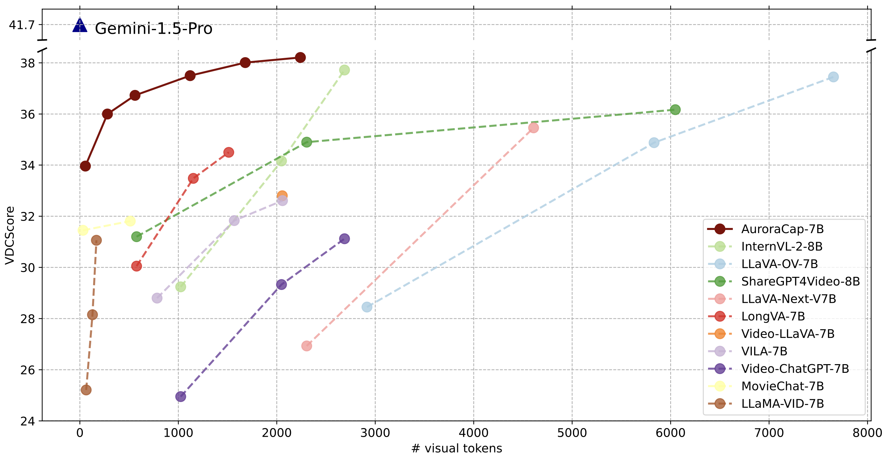

## Resources

- [Website](https://rese1f.github.io/aurora-web/)
- [arXiv: Paper](https://arxiv.org/abs/2410.03051)
- [GitHub: Code](https://github.com/rese1f/aurora)
- [Huggingface: AuroraCap Model](https://huggingface.co/collections/wchai/auroracap-66d117ffe13bedda96702013)
- [Huggingface: VDC Benchmark](https://huggingface.co/datasets/wchai/Video-Detailed-Caption)
- [Huggingface: Trainset](https://huggingface.co/datasets/wchai/AuroraCap-trainset)

## Docs

- [Train Docs](TRAIN.md) powered by [Xtuner](https://github.com/InternLM/xtuner).
- [Eval Docs](EVAL.md) powered by [lmms-eval](https://github.com/EvolvingLMMs-Lab/lmms-eval).
- [Deploy Docs](DEPLOY.md) powered by [SGLang](https://github.com/sgl-project/sglang).

[RETURN TO MAIN README](../../README.md)

## Features

AuroraCap is a efficient captioning model for image and video, achieving the best trade-off between performance and efficiency. Code for figure below can be found [here](../../figure_in_paper.ipynb).

AuroraCap achieves superior performance in video detailed captioning while utilizing significantly fewer visual tokens than other models, fully highlighting the efficiency of AuroraCap.


<br>

As a core training and inference strategy of AuroraCap, token merging plays a significant role in reducing the number of visual tokens. We show token merging visualization examples. From top to bottom, the image IDs are COCO:COCO-train2014-000000247906, VG:2331508, SA-1B:sa-393200. From left to right, the number of tokens representing the images are 490, 154, 18, and 6.


<br>

We further study how the AuroraCap's performance is influenced by token merge ratio. The solid line indicates the average performance, and the shaded area represents performance variability. We found that token merging significantly reduces the number of tokens while maintaining minimal performance drop.


## Quick Start

```
python inference.py \
    --model_path wchai/AuroraCap-7B-VID-xtuner \
    --prompt "Describe the video in detail." \
    --visual_input assets/auroracap/test.mp4 \
    --num_frm 8 \
    --token_kept_ratio 0.2 \
    --temperature 0.0 \
    --top_p 1.0 \
    --num_beams 1 \
    --max_new_tokens 2048
```

with Gradio GUI

```
python gradio_gui.py
```

## Beta Version with Transformers

Since the PR has not been merged yet, you can install the beta version with the following command:

```
pip install git+https://github.com/rese1f/transformers.git@aurora
```

And then you can use the following example code to run the inference:

### Single Image Inference

```python
from transformers import AuroraForConditionalGeneration, AuroraProcessor
import torch
from PIL import Image
import requests

model_id = "wchai/AuroraCap-7B-IMG"
processor = AuroraProcessor.from_pretrained(model_id)
model = AuroraForConditionalGeneration.from_pretrained(model_id, torch_dtype=torch.float16, low_cpu_mem_usage=True) 
model.to("cuda:0")

url = "https://llava-vl.github.io/static/images/view.jpg"
image = Image.open(requests.get(url, stream=True).raw)

conversation = [
    {
        "role": "user",
        "content": [
            {"type": "image"},
            {"type": "text", "text": "Describe the image in detail."},
        ],
    },
]

prompt = processor.apply_chat_template(conversation, add_generation_prompt=True)
inputs = processor(images=image, text=prompt, return_tensors="pt").to("cuda:0", torch.float16)

# autoregressively complete prompt
output = model.generate(**inputs, max_new_tokens=1024, token_kept_ratio=0.2)
print(processor.decode(output[0], skip_special_tokens=True))
```

### Video Inference

```python
from transformers import AuroraForConditionalGeneration, AuroraProcessor
import torch
from PIL import Image
import requests

import av
import numpy as np
from huggingface_hub import hf_hub_download

model_id = "wchai/AuroraCap-7B-VID"
processor = AuroraProcessor.from_pretrained(model_id)
model = AuroraForConditionalGeneration.from_pretrained(model_id, torch_dtype=torch.float16, low_cpu_mem_usage=True) 
model.to("cuda:0")

def read_video_pyav(container, indices):
    '''
    Decode the video with PyAV decoder.
    Args:
        container (`av.container.input.InputContainer`): PyAV container.
        indices (`List[int]`): List of frame indices to decode.
    Returns:
        result (np.ndarray): np array of decoded frames of shape (num_frames, height, width, 3).
    '''
    frames = []
    container.seek(0)
    start_index = indices[0]
    end_index = indices[-1]
    for i, frame in enumerate(container.decode(video=0)):
        if i > end_index:
            break
        if i >= start_index and i in indices:
            frames.append(frame)
    return np.stack([x.to_ndarray(format="rgb24") for x in frames])

# Load the video as an np.array, sampling uniformly 8 frames (can sample more for longer videos, up to 32 frames)
video_path = hf_hub_download(repo_id="raushan-testing-hf/videos-test", filename="sample_demo_1.mp4", repo_type="dataset")
container = av.open(video_path)
total_frames = container.streams.video[0].frames
indices = np.arange(0, total_frames, total_frames / 8).astype(int)
video = read_video_pyav(container, indices)


conversation = [
    {
        "role": "user",
        "content": [
            {"type": "image"}, # we still use image type for video input
            {"type": "text", "text": "Describe the video in detail."},
        ],
    },
]

prompt = processor.apply_chat_template(conversation, add_generation_prompt=True)
inputs = processor(videos=list(video), text=prompt, return_tensors="pt").to("cuda:0", torch.float16)

# autoregressively complete prompt
output = model.generate(**inputs, max_new_tokens=1024, token_kept_ratio=0.2)
print(processor.decode(output[0], skip_special_tokens=True))
```

## FAQ

Q: Can I only use token merging during inference?

A: No, our experiments show that token merging is also a way to accelerate training while maintaining similar performance. Additionally, besides auroracap, you can also use token merging on other llava-like models.

Q: How should I set the `token_kept_ratio` parameter?

A: AuroraCap uses token merging technique to reduce the number of visual tokens before fed into the llm decoder. We using `token_kept_ratio` range from 0 to 1 to control the number of visual tokens kept. For example, if `token_kept_ratio` is 0.5, then 50% of the visual tokens will be kept. We recommend to use `token_kept_ratio` in the range of 0.2 to 0.4 for better performance-cost trade-off for captioning tasks, above 0.5 for visual question answering tasks, and above 0.8 for OCR-related tasks.

Q: Why do we provide both Huggingface format and Xtuner format weights for AuroraCap?

A: While Xtuner supports saving checkpoints in multiple formats, it currently only allows continued training with the Xtuner format. Therefore, we currently provide the model in the Xtuner format for both continued training and inference. In the future, we will provide the model in the Huggingface format for both training and inference, enabling quicker SGLang deployment and integration with the transformers.

## Citation
```bibtex
@article{chai2024auroracap,
  title={AuroraCap: Efficient, Performant Video Detailed Captioning and a New Benchmark },
  author={Wenhao Chai, Enxin Song, Yilun Du, Chenlin Meng, Vashisht Madhavan, Omer Bar-Tal, Jeng-Neng Hwang, Saining Xie, Christopher D. Manning},
  journal={arXiv preprint arXiv:2410.03051},
  year={2024}
}
```
